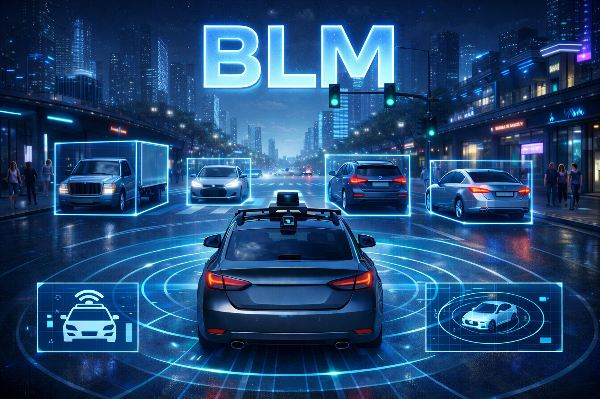
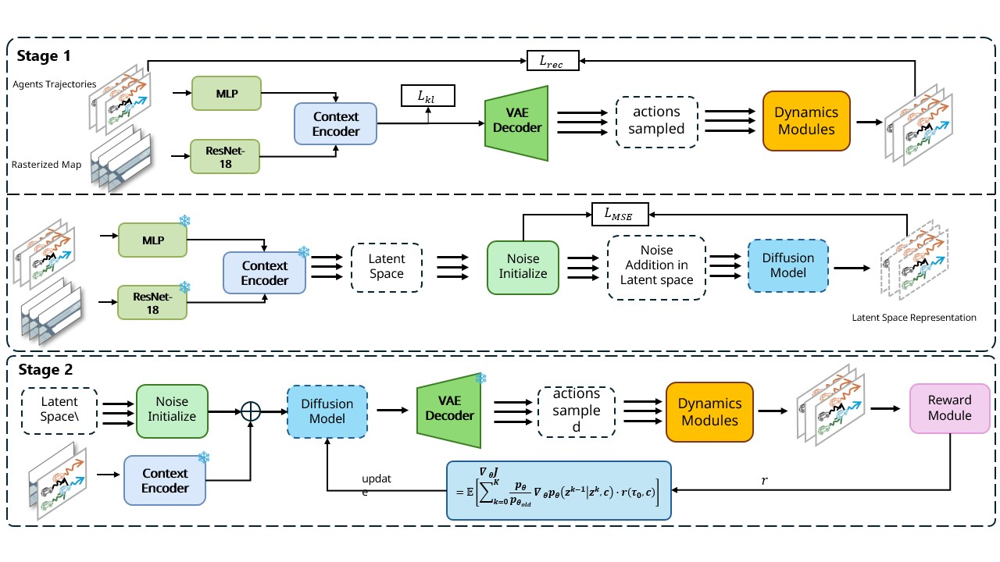

# BLM: Bi-level Training of Latent Diffusion Model for Traffic Simulation

<p align="center">
  
</p>

<p align="center">
  <a href="#overview">Overview</a> •
  <a href="#installation">Installation</a> •
  <a href="#dataset">Dataset</a> •
  <a href="#training">Training</a> •
  <a href="#rollout--simulation">Rollout</a> •
  <a href="#evaluation">Evaluation</a>
</p>


---

## 📖 Overview

**BLM (Bi-level Training of Latent Diffusion Model)** is a bi-level latent diffusion framework for **traffic simulation** that aims to generate driving scenarios that are **both realistic and precisely controllable**.  
Real-world testing is costly and lacks the flexibility to target specific objectives, while existing datasets and simulators often struggle to capture the diversity and criticality required for robust AV evaluation. BLM addresses this by enabling **automatic generation of diverse, fine-grained, and controllable interactive scenarios** for virtual testing.

BLM decomposes training into two phases:
1) learn the underlying traffic distribution efficiently in a **compact latent space**, and  
2) **fine-tune the diffusion model** to better satisfy **user-defined target objectives**.

---

### Key Components

- **Temporal-Convolutional VAE for Trajectory Encoding**
  - Compresses high-dimensional driving trajectories into a compact latent space while preserving task-relevant temporal structure.
  - A context-aware decoder reconstructs action sequences with fine-scale temporal variation, providing faithful inputs for downstream modules.

- **Latent Diffusion Model (DM)**
  - Trains a diffusion model in the latent space to model complex, multi-agent, spatiotemporal traffic behaviors.
  - This improves efficiency compared to operating directly in high-dimensional trajectory space.

- **Bi-level Fine-tuning via Reinforcement Learning**
  - **Stage I**: Train the latent diffusion model to capture realistic traffic behavior distributions.
  - **Stage II**: Fine-tune the diffusion model using Reinforcement Learning (RL), where decoded trajectories are evaluated by a reward module aligned with **user-specified objectives**.
  - Unlike guided sampling approaches, BLM **does not require the reward module to be differentiable**, and the fine-tuned diffusion model becomes inherently capable of generating trajectories that satisfy controllability criteria.

---

### Highlights

- **Realistic + Precisely Controllable Generation**
  - Produces diverse, fine-grained interactive scenarios while enabling control toward target objectives.

- **No Differentiable Reward Requirement**
  - The reward module can be non-differentiable (e.g., discrete or rule-based objectives).

- **Efficiency from Latent-space Modeling**
  - Reduces computational overhead and supports faster inference while maintaining overall generation quality.

- **Designed for Interactive Traffic Simulation**
  - Targets multi-agent interactions and spatiotemporal trajectory generation rather than static image synthesis.

---

---


### 🎬 Demo Videos

Click the links below to view demonstration videos:

- **[Scenario 1](assets/video_01.mp4)** - Normal driving scenario
- **[Scenario 2](assets/video_02.mp4)** - Interactive traffic scenario  
- **[Scenario 3](assets/video_03.mp4)** - Multi-agent interaction
- **[Scenario 4](assets/video_04.mp4)** - Complex urban scenario

> **Note:** Videos will open in a new tab. For best viewing experience, ensure video files are properly uploaded to the repository.


### 🏗️ Architecture

<p align="center">
  
</p>

---

## 🛠️ Installation

### Prerequisites

- Python 3.9+
- CUDA 11.7+
- PyTorch 2.0+

### Quick Install

```bash
# Clone the repository
git clone https://github.com/RoboSafe-Lab/BLM.git
cd BLM

# Create conda environment
conda create -n blm python=3.9 -y
conda activate blm

# Install dependencies
bash quick_install.sh
```

### Manual Installation

#### 1. Install CTG (Core Training Framework)

```bash
cd CTG
pip install -e .
```

#### 2. Install trajdata (Dataset Utilities)

```bash
cd ../trajdata
pip install -e .
```

#### 3. Install Pplan (Planning Module)

```bash
cd ../Pplan
pip install -e .
```

---

## 📦 Dataset

### Supported Datasets

| Dataset | Download |
|---------|----------|
| nuScenes | [Link](https://www.nuscenes.org/nuscenes) |
| nuPlan | [Link](https://www.nuscenes.org/nuplan) |

### Dataset Structure

Organize your dataset as follows:

```
nuscenes/
├── maps/
│   ├── basemap/
│   └── expansion/
├── v1.0-mini/           # For quick testing
│   ├── attribute.json
│   ├── sample.json
│   └── ...
└── v1.0-trainval/       # For full training
    ├── attribute.json
    ├── sample.json
    └── ...
```

### Dataset Configuration

Update dataset paths in your config files:

```json
{
  "trajdata_data_dirs": {
    "nusc_trainval": "/path/to/nuscenes",
    "nusc_mini": "/path/to/nuscenes"
  },
  "trajdata_cache_location": "/path/to/cache"
}
```

---

## 🚀 Training

### Training Pipeline Overview

```
┌──────────────┐     ┌────────────────────┐     ┌───────────────┐
│   Stage 1    │     │      Stage 2       │     │   Stage 3     │
│  VAE Train   │ --> │  Diffusion Train   │ --> │ RL Fine-tuning│
│              │     │                    │     │               │
└──────────────┘     └────────────────────┘     └───────────────┘
```

### Stage 1: VAE Training 

Train the VAE for trajectory encoding:

```bash
python CTG/scripts/vae_diffusion_train.py \
    --config_file vae_diffusion.json \
    --algo_name latent_vae
```


### Stage 2: Latent Diffusion Training

Train the latent diffusion model:

```bash
python CTG/scripts/vae_diffusion_train.py \
    --config_file vae_diffusion.json \
    --algo_name latent_diffusion
```


### Stage 3: PPO Fine-tuning

Fine-tune the diffusion model using PPO for realistic, stable scenarios:

```bash
python CTG/scripts/ppo.py \
    --config_file simulation_config.json \
    --policy_ckpt_dir safety_critical_trained_models/diffusion \
    --policy_ckpt_key iter100000
```


## 🎮 Rollout & Simulation

### Scene Rollout

Generate closed-loop simulations:

```bash
python CTG/scripts/cld_scene_rollout.py \
    --config_file simulation_config.json \
    --env trajdata \
    --policy_ckpt_dir safety_critical_trained_models/ppo_latent_dm \
    --policy_ckpt_key policy_best.ckpt \
    --num_scenes_per_batch 1 \
    --render
```

**Rollout Options:**

| Flag | Description |
|------|-------------|
| `--render` | Generate video visualizations |
| `--render_img` | Save first frame only |
| `--render_size` | Rendering resolution (default: 400) |
| `--num_scenes_per_batch` | Parallel scenes (default: 1) |


### Video Rendering

```bash
python CTG/scripts/cld_scene_rollout.py \
    --config_file simulation_config.json \
    --env trajdata \
    --render \
    --render_size 800 \
    --render_px_per_m 4.0 \
    --draw_mode action
```

**Draw Modes:**
- `action`: Show predicted actions
- `entire_traj`: Display full trajectories
- `map`: Focus on map visualization

---

## 📊 Evaluation

### Metrics Calculation

Evaluate simulation results with comprehensive metrics:

```bash
python CTG/scripts/calculate_metrics.py \
    --hdf5_dir results/simulation_data.hdf5 \
    --output_dir results/metrics \
    --nusc_dir /path/to/nuscenes
```

### Evaluation Metrics

| Category | Metric | Description |
|----------|--------|-------------|
| **Safety** | Collision Rate | Vehicle-to-vehicle collision frequency (collision_counts / (timesteps × agents)) |
| | Off-road Rate | Frequency of vehicles leaving drivable area (off-road_counts / (timesteps × agents)) |
| | Min TTC | Minimum Time-To-Collision across all vehicle pairs in the scene |
| | RSS Longitudinal | Count of Responsibility-Sensitive Safety longitudinal violations |
| | RSS Lateral | Count of Responsibility-Sensitive Safety lateral violations |
| **Realism** | JSD Velocity | Jensen-Shannon Divergence of velocity distributions between simulation and ground truth |
| | JSD Acceleration | JSD of acceleration distributions between simulation and ground truth |
| | JSD Jerk | JSD of jerk distributions between simulation and ground truth |
| **Diversity** | FDD | Final Displacement Diversity - average pairwise distance between trajectory endpoints |


## 📁 Project Structure

```
BLM/
├── CTG/                          # Core Training Framework
│   ├── scripts/
│   │   ├── vae_diffusion_train.py# VAE & DM stage-1 training
│   │   ├── ppo.py                # PPO fine-tuning
│   │   ├── cld_scene_rollout.py  # Simulation rollout
│   │   └── calculate_metrics.py  # Evaluation metrics
│   └── tbsim/
│       ├── algos/                # Algorithm implementations
│       ├── models/               # Neural network architectures
│       ├── policies/             # Policy wrappers
│       └── configs/              # Configuration classes
├── trajdata/                     # Dataset utilities
├── Pplan/                        # Planning module
├── vae_diffusion.json            # VAE & DM training config
├── simulation_config.json        # Rollout & Fine-tuning config
└── README.md
```

---


---


---

## 📄 Citation

If you find this work useful, please cite:

```bibtex
@article{blm2025,
  title   = {Bi-level Training of Latent Diffusion Model for Traffic Simulation},
  author  = {Yizhuo Xiao, Jiamin Yin, Mobing Cai, Ying Wang, Yuxin Zhang, Cheng Wang},
  journal = {arXiv preprint arXiv:2503.11771},
  year    = {2025},
  url     = {https://arxiv.org/abs/2503.11771}
}

```

---


## 📜 License

This project is licensed under the MIT License. See the [LICENSE](LICENSE) file for details.

### Third-Party Code Notice

This project builds upon and integrates several open-source libraries, including
**CTG**, **trajdata**, and **Pplan**. During development, parts of third-party code
may have been adapted or extended for integration purposes.

Original licenses and copyright notices are preserved where applicable.
Please refer to the original repositories for full license information.


---

## 🙏 Acknowledgements

- [nuScenes](https://www.nuscenes.org/) for the autonomous driving dataset
- [trajdata](https://github.com/NVlabs/trajdata) for unified trajectory data processing
- [Tianshou](https://github.com/thu-ml/tianshou) for RL training utilities

---

<p align="center">
  <i>Built with ❤️ by RoboSafe Lab</i>
</p>